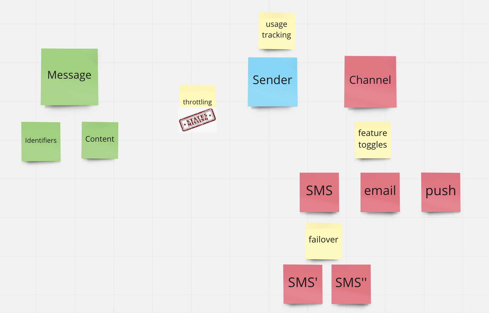

# The Notification Publisher Task - example with Twilio and AWS SES

## Background
The company has multiple services including one that provides a user identity and several that require sending notifications. The goal is to create a new service abstracting the notification part.

## Requirements
Create a service that accepts the necessary information and sends a notification to customers.

The new service should be capable of the following:

1. Send notifications via different channels.
   It should provide an abstraction between at least two different messaging service providers.
   It can use different messaging services/technologies for communication (e.g. SMS, email, push notification, Facebook Messenger, etc).

        Examples of some messaging providers:
        - Emails: AWS SES (SendEmail - Amazon Simple Email Service )
        - SMS messages: Twilio (Twilio SMS API Overview )
        - Push notifications: Pushy (Pushy - Docs - API - Send Notifications )

        All listed services are free to try and are pretty painless to sign up for, so please register your own test accounts with at least one of them.

2.  If one of the services goes down, your service can quickly failover to a different provider without affecting your customers:
It is possible to define several providers for the same type of notification channel. e.g. two providers for SMS.
A notification should be delayed and later resent if all providers fail.


3. The service is Configuration-driven: It is possible to enable/disable different communication channels with configuration.
   It is possible to send the same notification via several different channels.


## Solution 



- We have implemented two channels - SMS and Email 
- Channel could be enabled or disabled 
- Each could have multiple providers 
  - as a provider I mean Twilio / AWS etc 
  - Failover works only in the same channel - for example: 
    - Channel SMS, registered two Twilio and AWS, when one of the provider is down, then second will be available.


### How to run 

- all tests:
```./bin/test.sh```
- up the system:
```./bin/up.sh```


### CLI Scripts

- enable or disable channel sms


    ```docker-compose exec php ./bin/console notification-publisher:channel-status --channel=sms --flag=1```


- enable or disable channel email


    ```docker-compose exec php ./bin/console notification-publisher:channel-status --channel=email --flag=1```

- send a message
- to send a message you don't need to provide all parameters (phone and email), one of those is enough


    ```docker-compose exec php ./bin/console notification-publisher:manual --content="my content msg" --phone-number="48696987593" --email="aswierc@gmail.com"```

### Endpoint 

```
curl --location --request POST 'http://localhost/notification-publisher' \
--header 'Content-Type: application/json' \
--data-raw '{
    "content": "my content from endpoint",
    "phoneNumber": "48xxxxxxxxx",
    "email": "my-test@gmail.com"
}'
```

